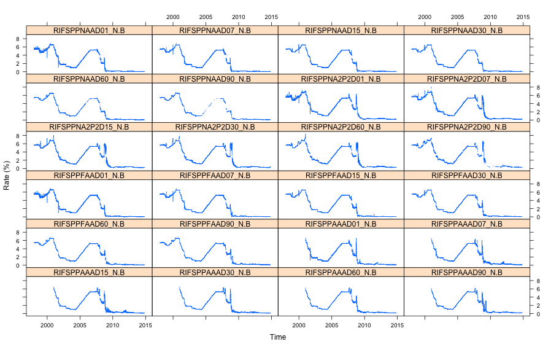
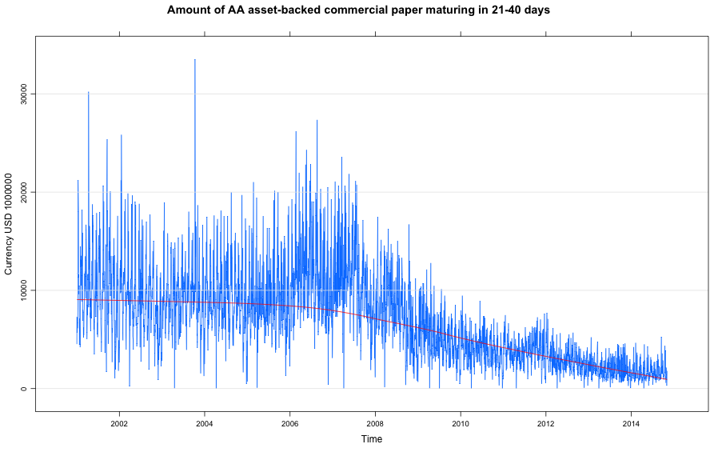

US Federal Reserve Bank Commercial Paper
========================================

This R package ```usfrbcp``` provides functions for processing the US Federal Reserve Bank's commercial paper data.  The main function posts a query to the US Federal Reserve Bank's web site.  By default the download includes commercial paper rates, volumes, and outstanding issue counts, variously in daily, weekly, or monthly frequency. The download data from the service is in compressed XML format.  The query function transforms that data into a list of products.  Several supporting functions then convert these lists by data type into smaller lists of data frames for convenient usage.  The data frames can be used as-is or converted easily to a time series format such as ```xts```. 

The main function retrieves the commercial paper data:

```{r}
require(usfrbcp)
cp <- getCommercialPaper()
summary(cp)
```

We then decompose this into the products of interest, such as

```{r}
rates <- getCommercialPaperRates(cp,"text")
summary(rates)

volumes <- getCommercialPaperVolumes(cp,"text")
summary(volumes)
```


The data frame might be converted to ```xts``` and plotted for example with ```lattice```:

```{r}
require(xts)
require(lattice)

df <- mergeSeries(rates)
xt = xts(df,order.by=as.Date(rownames(df)))
xyplot.ts(xt,scales=list(y=list(relation="same")),ylab="Rate (%)")
```



```{r}
xyplot.ts(xt,superpose=TRUE,auto.key=list(columns=4),ylab="Yield (%)")
```


One might also plot data from the volume series, which also contains dollar values:

```{r}
volumes <- getCommercialPaperVolumes(cp,"text")
v = volumes[[35]]
xyplot.ts(na.omit(xts(v$df,order.by=as.Date(rownames(v$df)))),
          ylab=paste(v$unit,v$currency,v$unit_mult),
          panel=function(x,...){
            panel.xyplot(x,...)
            panel.grid(-1,0)
            panel.loess(x,col=2,...)},
          main=v$short_desc)

```



Series Content
=============

RATES is data set with 24 Series:

1. Overnight AA nonfinancial commercial paper rate
1. 7-day AA nonfinancial commercial paper rate
1. 15-day AA nonfinancial commercial paper rate
1. 30-day AA nonfinancial commercial paper rate
1. 60-day AA nonfinancial commercial paper rate
1. 90-day AA nonfinancial commercial paper rate
1. Overnight A2/P2 nonfinancial commercial paper rate
1. 7-day A2/P2 nonfinancial commercial paper rate
1. 15-day A2/P2 nonfinancial commercial paper rate
1. 30-day A2/P2 nonfinancial commercial paper rate
1. 60-day A2/P2 nonfinancial commercial paper rate
1. 90-day A2/P2 nonfinancial rate
1. Overnight AA financial commercial paper rate
1. 7-day AA financial commercial paper rate
1. 15-day AA financial commercial paper rate
1. 30-day AA financial commercial paper rate
1. 60-day AA financial commercial paper rate
1. 90-day AA financial commercial paper rate
1. Overnight AA asset-backed commercial paper rate
1. 7-day AA asset-backed commercial paper rate
1. 15-day AA asset-backed commercial paper rate
1. 30-day AA asset-backed commercial paper rate
1. 60-day AA asset-backed commercial paper rate
1. 90-day AA asset-backed commercial paper rate

VOL is data set with 60 Series

1. Amount of AA nonfinancial commercial paper maturing in 1-4 days
1. Amount of A2/P2 nonfinancial commercial paper maturing in 1-4 days
1. Amount of AA financial commercial paper maturing in 1-4 days
1. Amount of AA asset-backed commercial paper maturing in 1-4 days
1. Amount of commercial paper maturing in 1-4 days
1. Number of issues of AA nonfinancial commercial paper maturing in 1-4 days
1. Number of issues of A2/P2 nonfinancial commercial paper maturing in 1-4 days
1. Number of issues of AA financial commercial paper maturing in 1-4 days
1. Number of issues of AA asset-backed commercial paper maturing in 1-4 days
1. Number of issues of commercial paper maturing in 1-4 days
1. Amount of AA nonfinancial commercial paper maturing in 5-9 days
1. Amount of A2/P2 nonfinancial commercial paper maturing in 5-9 days
1. Amount of AA financial commercial paper maturing in 5-9 days
1. Amount of AA asset-backed commercial paper maturing in 5-9 days
1. Amount of commercial paper maturing in 5-9 days
1. Number of issues of AA nonfinancial commercial paper maturing in 5-9 days
1. Number of issues of A2/P2 nonfinancial commercial paper maturing in 5-9 days
1. Number of issues of AA financial commercial paper maturing in 5-9 days
1. Number of issues of AA asset-backed commercial paper maturing in 5-9 days
1. Number of issues of commercial paper maturing in 5-9 days
1. Amount of AA nonfinancial commercial paper maturing in 10-20 days
1. Amount of A2/P2 nonfinancial commercial paper maturing in 10-20 days
1. Amount of AA financial commercial paper maturing in 10-20 days
1. Amount of AA asset-backed commercial paper maturing in 10-20 days
1. Amount of commercial paper maturing in 10-20 days
1. Number of issues of AA nonfinancial commercial paper maturing in 10-20 days
1. Number of issues of A2/P2 nonfinancial commercial paper maturing in 10-20 days
1. Number of issues of AA financial commercial paper maturing in 10-20 days
1. Number of issues of AA asset-backed commercial paper maturing in 10-20 days
1. Number of issues of commercial paper maturing in 10-20 days
1. Amount of AA nonfinancial commercial paper maturing in 21-40 days
1. Amount of A2/P2 nonfinancial commercial paper maturing in 21-40 days
1. Amount of AA financial commercial paper maturing in 21-40 days
1. Amount of AA asset-backed commercial paper maturing in 21-40 days
1. Amount of commercial paper maturing in 21-40 days
1. Number of issues of AA nonfinancial commercial paper maturing in 21-40 days
1. Number of issues of A2/P2 nonfinancial commercial paper maturing in 21-40 days
1. Number of issues of AA financial commercial paper maturing in 21-40 days
1. Number of issues of AA asset-backed commercial paper maturing in 21-40 days
1. Number of issues of commercial paper maturing in 21-40 days
1. Amount of AA nonfinancial commercial paper maturing in 41-80 days
1. Amount of A2/P2 nonfinancial commercial paper maturing in 41-80 days
1. Amount of AA financial commercial paper maturing in 41-80 days
1. Amount of AA asset-backed commercial paper maturing in 41-80 days
1. Amount of commercial paper maturing in 41-80 days
1. Number of issues of AA nonfinancial commercial paper maturing in 41-80 days
1. Number of issues of A2/P2 nonfinancial commercial paper maturing in 41-80 days
1. Number of issues of AA financial commercial paper maturing in 41-80 days
1. Number of issues of AA asset-backed commercial paper maturing in 41-80 days
1. Number of issues of commercial paper maturing in 41-80 days
1. Amount of AA nonfinancial commercial paper maturing in  greater than 80 days
1. Amount of A2/P2 nonfinancial commercial paper maturing in  greater than 80 days
1. Amount of AA financial commercial paper maturing in  greater than 80 days
1. Amount of AA asset-backed commercial paper maturing in  greater than 80 days
1. Amount of commercial paper maturing in  greater than 80 days
1. Number of issues of AA nonfinancial commercial paper maturing in greater than 80 days
1. Number of issues of A2/P2 nonfinancial commercial paper maturing in greater than 80 days
1. Number of issues of AA financial commercial paper maturing in greater than 80 days
1. Number of issues of AA asset-backed commercial paper maturing in greater than 80 days
1. Number of issues of commercial paper maturing in greater than 80 days

OUTST is data set with 77 Series

1. Total commercial paper outstanding; seasonally adjusted
1. Nonfinancial commercial paper outstanding; seasonally adjusted
1. Nonfinancial domestic commercial paper outstanding; seasonally adjusted
1. Nonfinancial foreign commercial paper outstanding; seasonally adjusted
1. Nonfinancial other commercial paper outstanding; seasonally adjusted
1. Financial commercial paper outstanding; seasonally adjusted
1. Financial domestic commercial paper outstanding; seasonally adjusted
1. Financial foreign commercial paper outstanding; seasonally adjusted
1. Financial other commercial paper outstanding; seasonally adjusted
1. Asset-backed commercial paper outstanding; seasonally adjusted
1. Other commercial paper outstanding; seasonally adjusted
1. Total commercial paper outstanding
1. Nonfinancial commercial paper outstanding
1. Nonfinancial domestic commercial paper outstanding
1. Nonfinancial foreign commercial paper outstanding
1. Nonfinancial other commercial paper outstanding
1. Financial commercial paper outstanding
1. Financial domestic commercial paper outstanding
1. Financial domestic commercial paper outstanding, U.S. owned
1. Financial domestic commercial paper outstanding, foreign bank parent
1. Financial domestic commercial paper outstanding, foreign nonbank parent
1. Financial domestic commercial paper outstanding, other
1. Financial foreign commercial paper outstanding
1. Financial foreign commercial paper outstanding, bank or bank holding company
1. Financial foreign commercial paper outstanding, other
1. Financial other commercial paper outstanding
1. Asset-backed commercial paper outstanding
1. Other commercial paper outstanding
1. SEC rule 2a-7 tier-1 commercial paper outstanding
1. SEC rule 2a-7 tier-2 commercial paper outstanding
1. Dealer placed nonfinancial commercial paper outstanding
1. Dealer placed financial commercial paper outstanding
1. Dealer placed asset-backed commercial paper outstanding
1. Dealer placed other commercial paper outstanding
1. Directly placed nonfinancial commercial paper outstanding
1. Directly placed financial commercial paper outstanding
1. Directly placed asset-backed commercial paper outstanding
1. Directly placed other commercial paper outstanding
1. Total commercial paper outstanding; seasonally adjusted
1. Nonfinancial commercial paper outstanding; seasonally adjusted
1. Nonfinancial domestic commercial paper outstanding; seasonally adjusted
1. Nonfinancial foreign commercial paper outstanding; seasonally adjusted
1. Nonfinancial other commercial paper outstanding; seasonally adjusted
1. Financial commercial paper outstanding; seasonally adjusted
1. Financial domestic commercial paper outstanding; seasonally adjusted
1. Financial foreign commercial paper outstanding; seasonally adjusted
1. Financial other commercial paper outstanding; seasonally adjusted
1. Asset-backed commercial paper outstanding; seasonally adjusted
1. Other commercial paper outstanding; seasonally adjusted
1. Total commercial paper outstanding
1. Nonfinancial commercial paper outstanding
1. Nonfinancial domestic commercial paper outstanding
1. Nonfinancial foreign commercial paper outstanding
1. Nonfinancial other commercial paper outstanding
1. Financial commercial paper outstanding
1. Financial domestic commercial paper outstanding
1. Financial domestic commercial paper outstanding, U.S. owned
1. Financial domestic commercial paper outstanding, foreign bank parent
1. Financial domestic commercial paper outstanding, foreign nonbank parent
1. Financial domestic commercial paper outstanding, other
1. Financial foreign commercial paper outstanding
1. Financial foreign commercial paper outstanding, bank or bank holding company
1. Financial foreign commercial paper outstanding, other
1. Financial other commercial paper outstanding
1. Asset-backed commercial paper outstanding
1. Other commercial paper outstanding
1. L.O.C. (letter of credit)-backed commercial paper outstanding
1. SEC rule 2a-7 tier-1 commercial paper outstanding
1. SEC rule 2a-7 tier-2 commercial paper outstanding
1. Dealer placed nonfinancial commercial paper outstanding
1. Dealer placed financial commercial paper outstanding
1. Dealer placed asset-backed commercial paper outstanding
1. Dealer placed other commercial paper outstanding
1. Directly placed nonfinancial commercial paper outstanding
1. Directly placed financial commercial paper outstanding
1. Directly placed asset-backed commercial paper outstanding
1. Directly placed other commercial paper outstanding
  
OUTST_YREND is data set with 4 Series

1. Total commercial paper outstanding, maturing after December 31
1. SEC rule 2a-7 tier-1 commercial paper outstanding, maturing after December 31
1. SEC rule 2a-7 tier-2 commercial paper outstanding, maturing after December 31
1. Asset-backed commercial paper outstanding, maturing after December 31
  
OUTST_OLD is data set with 25 Series

1. Total commercial paper outstanding; seasonally adjusted
1. Nonfinancial commercial paper outstanding; seasonally adjusted
1. Nonfinancial domestic commercial paper outstanding; seasonally adjusted
1. Nonfinancial foreign commercial paper outstanding; seasonally adjusted
1. Financial (including asset-backed) commercial paper outstanding; seasonally adjusted
1. Financial (including asset-backed) domestic commercial paper outstanding; seasonally adjusted
1. Financial (including asset-backed) foreign commercial paper outstanding; seasonally adjusted
1. Total commercial paper outstanding
1. Nonfinancial commercial paper outstanding
1. Nonfinancial domestic commercial paper outstanding
1. Nonfinancial foreign commercial paper outstanding
1. Financial (including asset-backed) commercial paper outstanding
1. Financial (including asset-backed) domestic commercial paper outstanding
1. Financial (including asset-backed) domestic commercial paper outstanding, U.S. owned
1. Financial (including asset-backed) domestic commercial paper outstanding, foreign bank parent
1. Financial (including asset-backed) domestic commercial paper outstanding, foreign nonbank parent
1. Financial (including asset-backed) foreign commercial paper outstanding
1. Financial (including asset-backed) foreign commercial paper outstanding, bank or bank holding company
1. Financial (including asset-backed) foreign commercial paper outstanding, other
1. Asset-backed commercial paper outstanding
1. L.O.C. (letter of credit)-backed commercial paper outstanding
1. SEC rule 2a-7 tier-1 commercial paper outstanding
1. SEC rule 2a-7 tier-2 commercial paper outstanding
1. Directly placed nonfinancial commercial paper outstanding
1. Directly placed financial commercial paper outstanding
  
RATES_OLD is data set with 12 Series

1. Overnight directly placed financial commercial paper rate
2. 7-day directly placed financial commercial paper rate
3. 3 15-day directly placed financial commercial paper rate
4. 4 30-day directly placed financial commercial paper rate
5. 5 60-day directly placed financial commercial paper rate
6. 6 90-day directly placed financial commercial paper rate
7. 7 Overnight dealer placed AA commercial paper rate
8. 7-day dealer placed AA commercial paper rate
9. 15-day dealer placed AA commercial paper rate
1. 30-day dealer placed AA commercial paper rate
1. 60-day dealer placed AA commercial paper rate
1. 90-day dealer placed AA commercial paper rate


References
----------

* [US Federal Reserve Bank](http://www.federalreserve.gov/datadownload/)
